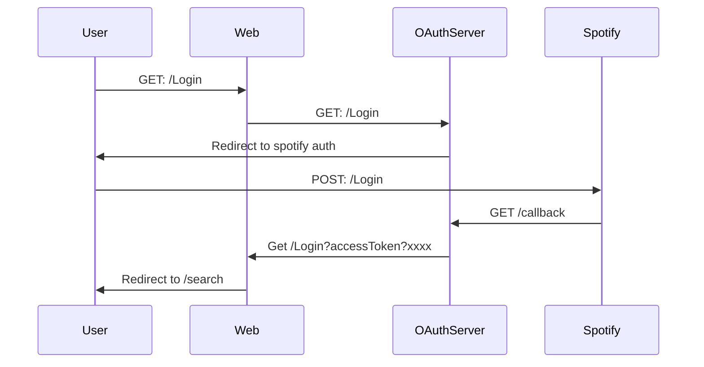

# 🎵 Spotify payfully test 🎵 

The application was bootstrapped with [Create React App](https://github.com/facebookincubator/create-react-app) and you can see the app runs [**here**](https://payfully-spotify-test.herokuapp.com/).

This application has 3 views:
- **Login**: Allows the user login with the spotify platform.
- **Search**: Allows the user search tracks using the spotify API.
- **TrackInfo**: Allows the user read the track information.

The application uses the spotify API. For allow the user interact with the sporify api, first of all we need to create an oauth server to allow the user login with the platform. [This Oauth server](https://payfully-spotify-api-test.herokuapp.com/) was created with node and its specific task is authenticate the user with spotify using the next flow:



## Folder Structure

After creation, your project should look like this:

```
spotify-test/
  README.md
  package.json
  static.json
  .gitignore
  .eslintrc
  .eslintingnore
  public/
    index.html
    favicon.ico
  src/
    actions/
    components/
    config/
    containers/
    reducers/
    routes/
    utils/
    index.scss
    index.js
```

## Project execution
### `npm start`

Runs the app in the development mode.<br>
Open [http://localhost:3000](http://localhost:3000) to view it in the browser.

The page will reload if you make edits.<br>
You will also see any lint errors in the console.

### `npm run build`

Builds the app for production to the `build` folder.<br>
It correctly bundles React in production mode and optimizes the build for the best performance.

The build is minified and the filenames include the hashes.<br>
Your app is ready to be deployed!

